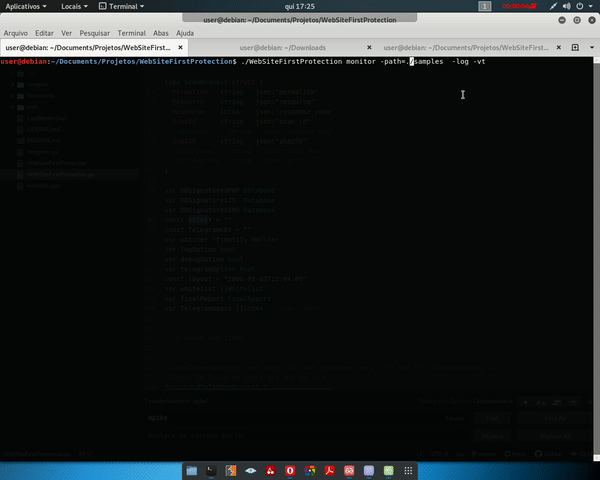

# WebSite First Protection

WebSite First Protection is a golang application for scanning website files for detect malwares.



## First Time
first run the code you need install golang and dependences

- To install golang go to [golang website](https://golang.org)
- To install depencences use go get

## This Project/code is based on:
- [PHP Malware Finder](https://github.com/nbs-system/php-malware-finder)
- [Web Malware Scanner](https://github.com/redteamcaliber/WebMalwareScanner)
- [Web Malware Collection](https://github.com/nikicat/web-malware-collection)

## Functionalities
  - Scan files on VirusTotal website (check **NOTICE** topic for information about it)
  - Whitelist files
  - Signatures check
  - log output format
  - Scan plain text files (.php, .js)
  - Partial image files support (progress)

## Notice
When use VirusTotal.com scan option you need pay attention to the rules of The Virus Total API.
- The VirtusTotal public API is limited to 4 requests per minute.
- The VirtusTotal public API **must not** be used in commercial products or services.

## Usage
- Get the API KEY on virtustotal.com and put in WebSiteFirstProtection.go (line 97)
- Get BOT code for telegram and put in WebSiteFirstProtection.go (line 98) and telegram.go (line 19)

```bash
WebSiteFirstProtection scan -path=/var/www/html -log -telegram
WebSiteFirstProtection monitor -path=/var/www/html -vt -log
```
Options:
- scan: Scan files once
- monitor: monitoring files
- vt: use virustotal.com to check files
- log: use to output log format
- telegram: use to send reports by telegram

## Telegram Report
To send telegram messages with reports, first you need creat a BOT on telegram. With the apikey of the BOT, open telegram.go (line 19) and insert the key.

You need create a telegramKey (line 16). This key will be the passphare that users will use to self registration on the service.

After that, users need send the message "\\monitor <passphase>" to the bot (the executable need be running when users send messages).

## Date options for log format

In WebSiteFirstProtection.go change **const layout** line 78 to adjust date format output.

Examples:

```golang
const layout = "2006-01-02T15:04:05"
const layout = "2006-01-02T15:04:05-0700"
const layout = "2 Jan 2006 15:04:05"
const layout = "2 Jan 2006 15:04"
const layout = "Mon, 2 Jan 2006 15:04:05 MST"
```


## Dependences
- [FsNotify](github.com/fsnotify/fsnotify)
- [Terminal Colors for golang](https://godoc.org/github.com/fatih/color)
- [Image Manipulation Project](github.com/rwcarlsen/goexif)
- [Telegram API](github.com/go-telegram-bot-api/telegram-bot-api)
